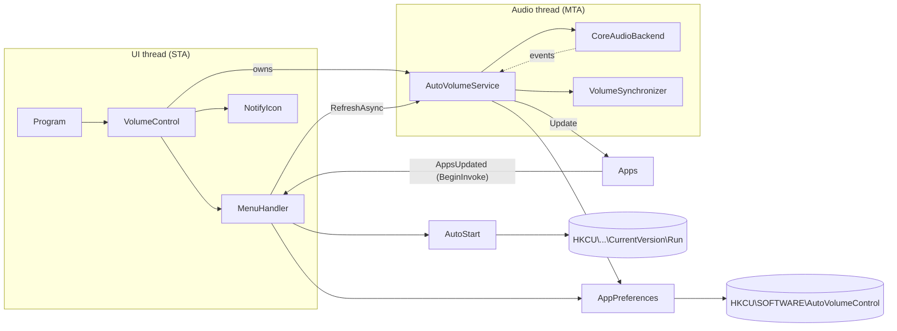

# Architecture

AutoVolumeControl is a Windows tray application (.NET Framework 4.8, WinForms) that keeps the
volume and mute state of selected applications equal to the master volume of the default
playback device.

## Overview

## Components

| Class | Responsibility |
|---|---|
| `Program` | Entry point; enables visual styles and runs `VolumeControl`. |
| `VolumeControl` | `ApplicationContext`: owns the tray icon, context menu, settings and the service. Marshals `Apps.AppsUpdated` to the UI thread. |
| `MenuHandler` | Builds the tray menu (one checkbox per app, "Start with Windows", Exit). Rebuilds only when the content changed and disposes the old items. |
| `AutoVolumeService` | Orchestrates everything audio related on the `AudioThread`: attach to the device, list apps, sync volumes, react to events. |
| `AudioThread` | One long-lived MTA thread with a work queue. All COM objects are created, used and released there. |
| `IAudioBackend` / `CoreAudioBackend` | Access to the default playback device via CSCore: master volume, sessions, and notifications (volume changed, session created, default device changed). |
| `VolumeSynchronizer` | Applies master volume + mute to every enabled session; a failing session does not stop the others. |
| `SessionNameResolver` | Single source of truth for an app's name (process name, else exe name from the session identifier, else display name, else identifier). |
| `Apps` | Thread-safe list of apps that currently have a session; raises `AppsUpdated` on change. |
| `AppPreferences` | Per-app enabled flag on top of `ISettingsStore`; new apps default to enabled, invalid values are tolerated. |
| `AppSettings` | `ISettingsStore` backed by `HKCU\SOFTWARE\<ProductName>` (string values). |
| `AutoStart` | "Start with Windows" entry in `HKCU\Software\Microsoft\Windows\CurrentVersion\Run` (quoted path). |

## Threading model

- **UI thread (STA)** – WinForms message loop. Never touches COM audio objects.
- **Audio thread (MTA)** – created by `AutoVolumeService`. Every backend call is posted to it, so:
  - COM is initialized once and objects never outlive their apartment;
  - work runs strictly in order;
  - shutdown releases COM objects on the thread that created them after queued work finished.
- **System callback threads** – Core Audio raises notifications on its own threads. The backend
  only forwards them as events; the service posts work to the audio thread and never calls back
  into the audio API from the callback (which could deadlock).

## Flows

### Start
1. `VolumeControl` creates the service and calls `Start()`.
2. On the audio thread: `Attach()` binds to the default render device (role Multimedia),
   registers the volume callback and session notifications, then runs a sync.
3. If no device is available the task faults and the tray shows a balloon tip; a later
   default-device change retries automatically.

### Master volume changed
1. The endpoint callback raises `MasterVolumeChanged`.
2. `RequestSync()` enqueues at most one pending sync (further requests are merged).
3. The sync reads the *current* master volume/mute, enumerates the sessions once, updates `Apps`
   and applies the values to all enabled apps. Because the value is read when the sync runs,
   a burst of notifications always ends on the latest volume.

### New app starts playing
`SessionCreated` → `RequestSync()` → the app appears in the menu and gets the master volume.

### Default device changed
`DefaultDeviceChanged` (render / multimedia) → re-attach to the new device → sync.

### Menu opened
`Opening` → `RefreshAsync()` (waits at most 500 ms) → `Generate()`. `Generate()` compares a
description of the content (apps, their flags, autostart) with the last rendered one and only
rebuilds when it differs.

## Persistence

| Location | Content |
|---|---|
| `HKCU\SOFTWARE\AutoVolumeControl\<app>` | `"True"` / `"False"` – whether the app is synced. Written as `"True"` when an app is seen for the first time. |
| `HKCU\Software\Microsoft\Windows\CurrentVersion\Run\AutoVolumeControl` | `"<path to exe>"` when autostart is enabled. |

## Build & packaging

- `src/AutoVolumeControl` – SDK-style project targeting `net48`.
- Costura.Fody embeds all dependencies, so the output is a single `AutoVolumeControl.exe`.
- `app.manifest` declares supported Windows versions; `App.config` enables PerMonitorV2 DPI awareness.
- `tests/AutoVolumeControl.Tests` – xUnit tests (see README).

## Notes

- Windows multiplies session volume with the endpoint volume. Setting an app to the master
  scalar therefore results in an effective level of `master²` (e.g. 50 % → 25 %). This is the
  behaviour the app has always had; it is documented here so it is a conscious choice.
- Apps are identified by process name, so two different programs with the same executable name
  share one setting.
