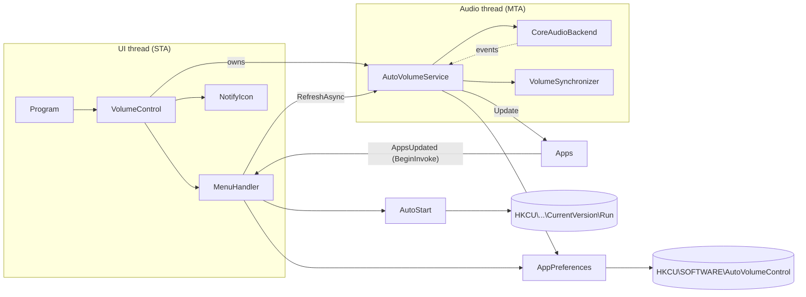

# Architecture

AutoVolumeControl is a Windows tray application (.NET Framework 4.8, WinForms) that keeps the
volume and mute state of selected applications equal to the master volume of the default
playback device.

## Overview

## Components

| Class | Responsibility |
|---|---|
| `Program` | Entry point; ensures a single instance, logs unhandled exceptions and runs `VolumeControl`. |
| `CompatLayer` | Restarts the app once without DPI compatibility layers inherited from the launcher. |
| `SingleInstance` | Named mutex so two instances never sync against each other. |
| `VolumeControl` | `ApplicationContext`: owns the tray icon, context menu, settings and the service. Marshals `Apps.AppsUpdated` to the UI thread. |
| `MenuHandler` | Builds the tray menu (one checkbox per app, "Start with Windows", Exit). Rebuilds only when the content changed and disposes the old items. |
| `AutoVolumeService` | Orchestrates everything audio related on the `AudioThread`: attach to the device, list apps, sync volumes, react to events. |
| `AudioThread` | One long-lived MTA thread with a work queue. All COM objects are created, used and released there. |
| `IAudioBackend` / `CoreAudioBackend` | Access to the default playback device via CSCore. Keeps one `SessionWatch` per running app session that caches its name and volume interface and forwards its events; the session list is only re-read after an event that can change it. |
| `VolumeSynchronizer` | Writes master volume + mute to every enabled session where it differs; a failing session does not stop the others. |
| `SessionFilter` | Decides which sessions belong to running apps (not expired, process alive, process ID not reused). |
| `AudioEventRules` | Which default-device changes and session disconnect reasons require a re-attach. |
| `CorrectionThrottle` | Pauses corrections for an app that keeps resetting its own volume, so the two apps cannot fight in a loop. |
| `LogFile` | Timestamped `Trace` log in `%LOCALAPPDATA%\AutoVolumeControl` (rotated at 1 MB). |
| `SessionNameResolver` | Single source of truth for an app's name (process name, else exe name from the session identifier, else display name, else identifier). |
| `Apps` | Thread-safe list of apps that currently have a session; raises `AppsUpdated` on change. |
| `AppPreferences` | Per-app enabled flag on top of `ISettingsStore`; new apps default to enabled, invalid values are tolerated. |
| `AppSettings` | `ISettingsStore` backed by `HKCU\SOFTWARE\<ProductName>` (string values). |
| `AutoStart` | "Start with Windows" entry in `HKCU\Software\Microsoft\Windows\CurrentVersion\Run` (quoted path). |

## Threading model

- **UI thread (STA)** – WinForms message loop. Never touches COM audio objects.
- **Audio thread (MTA)** – created by `AutoVolumeService`. Every backend call is posted to it, so:
  - COM is initialized once and objects never outlive their apartment;
  - work runs strictly in order;
  - shutdown releases COM objects on the thread that created them after queued work finished.
- **System callback threads** – Core Audio raises notifications on its own threads. The backend
  only forwards them as events; the service posts work to the audio thread and never calls back
  into the audio API from the callback (which could deadlock).

## Flows

All audio work is one **reconcile** step on the audio thread:

1. attach to the default device if not attached or if a re-attach was requested;
2. read the master volume and the sessions of running apps (expired sessions and sessions of exited
   processes are left out). The sessions are cached; they are only re-read from Windows after an event that
   can change the list, so a master volume change costs one read plus the necessary writes;
3. update `Apps` and register new apps (enabled by default);
4. write volume/mute of enabled apps **only where they differ** from the master (tolerance 0.001). If an app
   keeps resetting its own volume to something else while the master stays the same, corrections for it pause
   for 60 s after 10 corrections within 10 s (`CorrectionThrottle`); master changes reset the count.

`RequestSync()` merges requests: at most one reconcile is queued, and it reads the master volume when it
runs, so a burst of notifications always ends on the latest value.

### Triggers (event driven)

| Event | Source | Effect |
|---|---|---|
| Master volume/mute changed | `IAudioEndpointVolumeCallback` | reconcile |
| New session | `IAudioSessionNotification` | reconcile (app listed and synced) |
| Session state changed (active, inactive, expired) | `IAudioSessionEvents` per session | reconcile |
| App changed its own volume/mute | `IAudioSessionEvents` per session | reconcile (corrected); our own writes carry `CoreAudioBackend.EventContext` and are ignored |
| App process exited | `Process.Exited` per session | reconcile (app removed) |
| Session disconnected (device removed, audio service shut down) | `IAudioSessionEvents` (app sessions and the system sounds session) | re-attach + reconcile |
| Default device changed | `IMMNotificationClient` | re-attach + reconcile |
| App enabled/disabled in the menu | `AppPreferences.Changed` | reconcile (enabled app synced immediately) |
| Menu opened | `ContextMenuStrip.Opening` | reconcile (waits at most 500 ms), then `Generate()` |

### Failure and recovery

- `Attach()` is all-or-nothing: on any error everything (including the device enumerator) is released
  and the backend reports not attached.
- If attaching or reading fails (no device, audio service not running yet at logon, audio service
  restarted), the app list is kept or cleared accordingly and a **retry timer** runs until a reconcile
  succeeds, with a doubling delay (3 s, 6 s, ... 60 s). While everything works the timer is stopped, so there
  is no polling. With no device at all the enumerator is kept, so its default-device event reports a new
  device immediately.
- A service restart is noticed through the disconnect event of any watched session. The system sounds
  session is always watched for this, so it also works when no app plays audio.
- A start failure is shown as a balloon tip only if it persists for 15 s (at logon the audio service is often
  ready a few seconds later).

### Menu
`Generate()` compares a description of the content (apps, their flags, autostart) with the last rendered
one and only rebuilds when it differs; replaced items are disposed.

## Persistence

| Location | Content |
|---|---|
| `HKCU\SOFTWARE\AutoVolumeControl\<app>` | `"True"` / `"False"` – whether the app is synced. Written as `"True"` when an app is seen for the first time. |
| `HKCU\Software\Microsoft\Windows\CurrentVersion\Run\AutoVolumeControl` | `"<path to exe>"` when autostart is enabled. |

## Build & packaging

- `src/AutoVolumeControl` – SDK-style project targeting `net48`.
- Costura.Fody embeds all dependencies, so the output is a single `AutoVolumeControl.exe`.
- `app.manifest` declares the supported Windows versions and system DPI awareness.
- `tests/AutoVolumeControl.Tests` – xUnit tests (see README).

## DPI and sharpness

- The process is **system DPI aware** (`app.manifest`): WinForms and MaterialSkin render the menu natively at
  the system scaling (e.g. 144 DPI at 150 %) instead of being bitmap-stretched by Windows.
- Windows passes compatibility settings to child processes via the `__COMPAT_LAYER` environment variable. A
  launcher with "Override high DPI scaling: System (Enhanced)" (e.g. a file manager) would force the app to be
  DPI unaware (`DPIUNAWARE GDIDPISCALING`), making the menu large and blurry. `CompatLayer` detects these
  inherited layers and restarts the app once without them; other layers are kept.
- The tray icon is loaded in `SystemInformation.SmallIconSize` (24x24 at 150 %) from the multi-size `icon.ico`,
  so Windows does not downscale a larger image.
- Limitation: on a monitor whose scaling differs from the primary monitor, Windows scales the menu of a system
  aware app. Per-monitor awareness would need the MaterialSkin menu to rescale itself on DPI changes, which it
  does not support.

## Core Audio API rules followed

- Session notifications are registered on an MTA thread and `IAudioSessionEnumerator::GetCount` is called once
  afterwards; Windows discards session notifications before that.
- Our notification handlers never block and never call the audio API; they only set flags and post work to
  the audio thread. The session reference CSCore adds for `SessionCreated` is queued and released on the audio
  thread. Note that CSCore itself registers an `IAudioSessionEvents` for the new session inside
  `OnSessionCreated` before our handler runs; that is outside our control.
- On detach the session manager is disposed (unregistering at the audio API) before the managed handler is
  removed, because CSCore reads the handler twice while raising the event.
- CSCore unregisters COM callbacks in finalizers. When a release fails (e.g. the audio service stopped), the
  finalizer is suppressed, and `legacyUnhandledExceptionPolicy` in `App.config` keeps a failing finalizer of a
  half-constructed CSCore object from ending the process (it is still logged).

## Known limitations

- Only the default playback device (role Multimedia) is watched; apps routed to another device are not listed.
- Exit of processes the app may not open (protected system processes) is not observed directly; their session
  state changes still trigger a refresh.
- Per-channel volume changes by an app (`IChannelAudioVolume`) are not corrected; only the overall session
  volume is synced.

## Notes

- Windows multiplies session volume with the endpoint volume. Setting an app to the master
  scalar therefore results in an effective level of `master²` (e.g. 50 % → 25 %). This is the
  behaviour the app has always had; it is documented here so it is a conscious choice.
- Apps are identified by process name, so two different programs with the same executable name
  share one setting.
