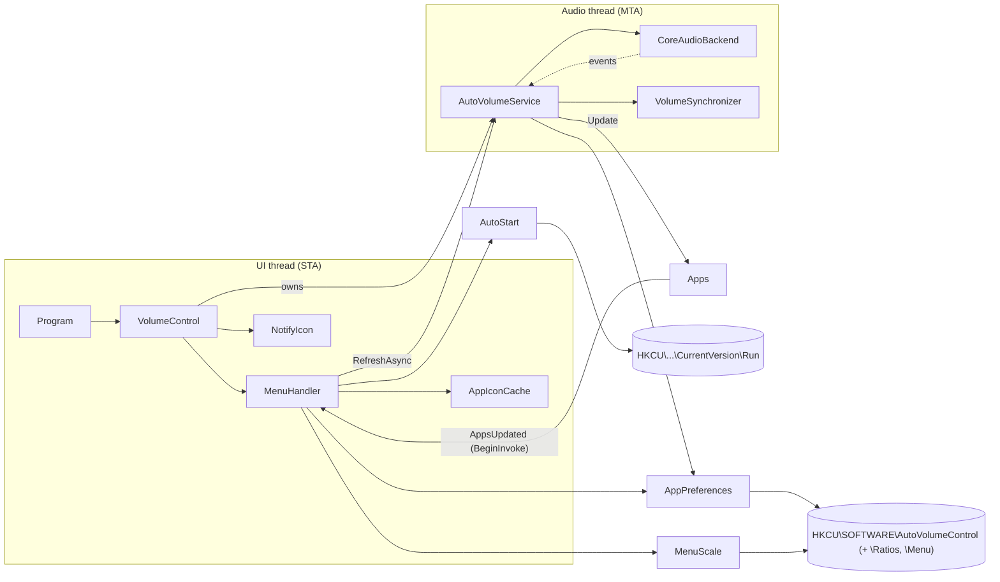

# Architecture

AutoVolumeControl is a Windows tray application (.NET Framework 4.8, WinForms with own Material style menu controls) that keeps the
volume and mute state of selected applications equal to the master volume of the default
playback device.

## Overview

## Components

| Class | Responsibility |
|---|---|
| `Program` | Entry point; ensures a single instance, logs unhandled exceptions and runs `VolumeControl`. |
| `CompatLayer` | Restarts the app once without DPI compatibility layers inherited from the launcher. |
| `SingleInstance` | Named mutex so two instances never sync against each other. |
| `VolumeControl` | `ApplicationContext`: owns the tray icon, context menu, settings and the service. Marshals `Apps.AppsUpdated` to the UI thread. |
| `MenuHandler` | Builds the tray menu (title; "App Scale" bar; one row per app: checkbox, icon, name and ratio slider; "Start with Windows"; Exit) in the current scale. Rebuilds only when the content changed, disposes the old items and waits while a mouse button is held down on the open menu. |
| `MenuScale` | The user's menu size (85/100/115/130 %, default 100 %) on top of `ISettingsStore`; invalid values are tolerated. |
| `MenuTheme` / `MenuRenderer` / `MenuFonts` | Colors (Material light theme: indigo primary, pink accent), the renderer of the menu background, border and separators, and the fonts of one scale. |
| `MenuCheckBox` / `MenuSlider` | Owner-drawn Material style checkbox and slider whose every size is multiplied by a `ScaleFactor`. The slider raises `ValueChangedByUser` for clicks, drags and the mouse wheel (up = higher) and can show its value or tick labels. |
| `AppIconCache` | UI thread only. One bitmap per app name in `IconSize` (`SystemInformation.SmallIconSize` × the menu size), read from the executable via the shell (`SHGetFileInfo`; the large icon scaled down above the small size) and converted with `Icon.ToBitmap` (keeps the alpha channel), else the generic application icon. Drops icons of apps that are no longer shown and all icons when the size changes; disposed by `VolumeControl`. |
| `WindowTitles` | The title of an app's window for the menu: follows the audio process's parents with the same executable (browsers play audio from a helper process), takes the topmost visible, unowned, uncloaked window of these processes (`EnumWindows` lists in z-order) and removes a trailing browser name. |
| `RatioSlider` | The 0–100 % `MenuSlider` of an app row; the mouse wheel moves it by 5 %. |
| `AutoVolumeService` | Orchestrates everything audio related on the `AudioThread`: attach to the device, list apps, sync volumes, react to events. |
| `AudioThread` | One long-lived MTA thread with a work queue. All COM objects are created, used and released there. |
| `IAudioBackend` / `CoreAudioBackend` | Access to the default playback device via the Windows Core Audio API. Keeps one `SessionWatch` per running app session that caches its name and volume interface and forwards its events; the session list is only re-read after an event that can change it. |
| `VolumeSynchronizer` | Writes master volume × the app's ratio, and the master mute state, to every enabled session where it differs; a failing session does not stop the others. |
| `CoreAudioInterop` | The Core Audio COM interfaces used (from the Windows SDK headers `mmdeviceapi.h`, `endpointvolume.h`, `audiopolicy.h`). |
| `SessionFilter` | Decides which sessions belong to running apps (not expired, process alive, process ID not reused). |
| `AudioEventRules` | Which default-device changes and session disconnect reasons require a re-attach. |
| `CorrectionThrottle` | Pauses corrections for an app that keeps resetting its own volume, so the two apps cannot fight in a loop. |
| `LogFile` | Timestamped `Trace` log in `%LOCALAPPDATA%\AutoVolumeControl` (rotated at 1 MB). |
| `SessionNameResolver` | Single source of truth for an app's name (process name, else exe name from the session identifier, else display name, else identifier). Also turns the NT device path in a session identifier into a drive path. |
| `ExecutableLocator` | Finds an app's executable for its icon: `QueryFullProcessImageName` with `PROCESS_QUERY_LIMITED_INFORMATION` (works for most processes, including many elevated ones), else the path in the session identifier (device prefix mapped with `QueryDosDevice`), else the session's icon path if it names an `.exe` (a DLL would only give the DLL file-type icon). |
| `Apps` | Thread-safe list of apps (`AppInfo`: name and executable, unique by name) that currently have a session; raises `AppsUpdated` on change, including when an app's executable becomes known. |
| `AppPreferences` | Per-app enabled flag and volume ratio on top of `ISettingsStore`; new apps default to enabled and 100 %, invalid values are tolerated. |
| `AppSettings` | `ISettingsStore` backed by `HKCU\SOFTWARE\<ProductName>` (string values), with sub-stores in subkeys. |
| `AutoStart` | "Start with Windows" entry in `HKCU\Software\Microsoft\Windows\CurrentVersion\Run` (quoted path). |

## Threading model

- **UI thread (STA)** – WinForms message loop. Never touches COM audio objects.
- **Audio thread (MTA)** – created by `AutoVolumeService`. Every backend call is posted to it, so:
  - COM is initialized once and objects never outlive their apartment;
  - work runs strictly in order;
  - shutdown releases COM objects on the thread that created them after queued work finished.
- **System callback threads** – Core Audio raises notifications on its own threads. The backend
  only forwards them as events; the service posts work to the audio thread and never calls back
  into the audio API from the callback (which could deadlock).

## Flows

All audio work is one **reconcile** step on the audio thread:

1. attach to the default device if not attached or if a re-attach was requested;
2. read the master volume and the sessions of running apps (expired sessions and sessions of exited
   processes are left out). The sessions are cached; they are only re-read from Windows after an event that
   can change the list, so a master volume change costs one read plus the necessary writes;
3. update `Apps` (with the first known executable per app name) and register new apps (enabled by default);
4. write volume/mute of enabled apps **only where they differ** from the target, master volume × the app's ratio
   (tolerance 0.001). If an app
   keeps resetting its own volume to something else while the master stays the same, corrections for that session
   pause for 60 s after 10 corrections within 10 s (`CorrectionThrottle`). A master or ratio change ends the pause
   and is always applied; when a pause ends without any event, the timer triggers the correction.

`RequestSync()` merges requests: at most one reconcile is queued, and it reads the master volume when it
runs, so a burst of notifications always ends on the latest value.

### Triggers (event driven)

| Event | Source | Effect |
|---|---|---|
| Master volume/mute changed | `IAudioEndpointVolumeCallback` | reconcile |
| New session | `IAudioSessionNotification` | reconcile (app listed and synced) |
| Session state changed (active, inactive, expired) | `IAudioSessionEvents` per session | reconcile |
| App changed its own volume/mute | `IAudioSessionEvents` per session | reconcile (corrected); our own writes carry `CoreAudioBackend.EventContext` and are ignored |
| App process exited | `Process.Exited` per session | reconcile (app removed) |
| Session disconnected (device removed, audio service shut down) | `IAudioSessionEvents` (app sessions and the system sounds session) | re-attach + reconcile |
| Default device changed | `IMMNotificationClient` | re-attach + reconcile |
| App enabled/disabled in the menu | `AppPreferences.Changed` | reconcile (enabled app synced immediately) |
| Ratio slider moved | `AppPreferences.Changed` (only when the percent value changed) | reconcile; while dragging, requests are merged, so the app follows the slider live |
| Menu opened | `ContextMenuStrip.Opening` | session list re-read from Windows + reconcile (waits at most 500 ms), then `Generate()` |

### Failure and recovery

- `Attach()` is all-or-nothing: on any error everything (including the device enumerator) is released
  and the backend reports not attached.
- If attaching or reading fails (no device, audio service not running yet at logon, audio service
  restarted), the app list is kept or cleared accordingly and a **retry timer** runs until a reconcile
  succeeds, with a doubling delay (3 s, 6 s, 12 s, then every 15 s). While everything works the timer is stopped, so there
  is no polling. With no device at all the enumerator is kept, so its default-device event reports a new
  device immediately.
- A service restart is noticed through the disconnect event of any watched session. The system sounds
  session is always watched for this, so it also works when no app plays audio.
- A start failure is shown as a balloon tip only if it persists for 15 s (at logon the audio service is often
  ready a few seconds later).

### Menu
`Generate()` compares a description of the content (apps, their flags and ratios, whether an icon is known,
autostart, menu size and DPI) with the last rendered one and only rebuilds when it differs; replaced items are disposed. Changes
made in the menu itself (app checkbox, slider, autostart) update that description, so they do not cause a rebuild;
a change made elsewhere that the menu does not show yet still does.

Rows: `[checkbox] [icon] title  [slider 0–100 %]` in a `TableLayoutPanel`. The title is the app's window title
(`WindowTitles`, via the sessions' process IDs in `AppInfo.ProcessIds`), else the app name, cut off with "…" at
200 px (scaled); the label and the icon have a tooltip with the full title and the app name. Titles are read when
the menu opens (and for apps that appear while it is open) and then kept, so rows do not change while the menu is
used; a new title on the next opening rebuilds the row. The settings stay keyed by the app name. For a browser the
title is its active tab, which Windows does not tell apart from the tab playing audio. Clicking the icon or the name toggles the
checkbox; the slider is disabled while the app is unchecked. The table keeps the menu's background color: the
checkboxes and sliders fill their background with their parent's color, and a transparent one renders black. The
rows span the menu (like the scale bar and the Exit button): checkbox, icon and name on the left, the slider
aligned right, the name column takes the remaining width.

The slider (`RatioSlider`) reports every step while dragging. Each step takes effect
immediately (in memory, `AppPreferences.SetRatioPercent(..., persist: false)`, which raises `Changed`, and the
service merges the resulting sync requests), so the app follows the slider live; the final value is written to the
registry once when the drag ends (mouse-up, lost mouse capture, menu closed or reopened). The mouse wheel moves the
slider by 5 % per notch (up = louder) and is written immediately.

### Menu size ("App Scale")
Order: title, scale bar, apps, "Start with Windows", Exit (separated by lines; no empty app section).

Everything in the menu is sized at 96 DPI and 100 % and multiplied by `DeviceDpi / 96 × BaseScale (1.3) × MenuScale.Factor` (so the default of 100 % is 1.3 times the base sizes): fonts,
checkboxes, sliders, icons, spacing, the Exit button and so the menu itself. The scale bar below the title is a
slider over the four sizes (labelled 85 %–130 %) between a small and a large "A" (clicking a letter moves one
step), drawn at 80 % of the menu's size. Like the Exit button it spans the menu: both are sized to the widest
other item (`FitFullWidthItems`; separators do not count, and `MenuSeparator` asks for no width, since a
plain separator asks for the menu's current width and the menu would grow with every rebuild) and stretched by
`FullWidthControlHost`, which also takes over any height change of its control. The app table and the scale bar
are `MenuTable`s, which grow to their content after each layout, so a row can never cover the separator below. While the slider is dragged it only marks
the step; the size is stored and the menu rebuilt when the slider is released, since a rebuild replaces the slider
under the mouse. A click on the track or the mouse wheel applies immediately. The rebuild runs from the
deferred-rebuild timer, never inside the slider's own event. When the open menu changes its size it keeps the
corner nearest to where it was opened (the bottom right above the tray) and stays within the working area. Old
fonts and icons are disposed together with the old items.

While a mouse button is held down on the open menu, a rebuild (e.g. because an app started or exited) is
deferred, so a slider being dragged is not destroyed. A timer checks every 50 ms whether the button was released
(a mouse-up does not reliably reach the menu, e.g. over a separator or outside it) and then rebuilds; opening the
menu always builds. While a slider is dragged, a click outside the menu does not close it.

## Persistence

| Location | Content |
|---|---|
| `HKCU\SOFTWARE\AutoVolumeControl\<app>` | `"True"` / `"False"` – whether the app is synced. Written as `"True"` when an app is seen for the first time. |
| `HKCU\SOFTWARE\AutoVolumeControl\Menu\Scale` | Integer percent `"85"`, `"100"`, `"115"` or `"130"` – the menu size. Missing or unreadable means 100 %, other numbers snap to the nearest size. Written when a new size is chosen. |
| `HKCU\SOFTWARE\AutoVolumeControl\Ratios\<app>` | Integer percent `"0"`–`"100"` (culture invariant) – the app's share of the master volume. Missing or unreadable means 100 %, out of range is clamped. A subkey, so it cannot clash with the flags; created on the first write. Written when a slider drag ends or the mouse wheel moves a slider. |
| `HKCU\Software\Microsoft\Windows\CurrentVersion\Run\AutoVolumeControl` | `"<path to exe>"` when autostart is enabled. |

## Build & packaging

- `src/AutoVolumeControl` – SDK-style project targeting `net48`.
- Costura.Fody embeds any dependencies (currently none), so the output is a single `AutoVolumeControl.exe`;
  `AutoVolumeControl.exe.config` is optional (it only names the runtime version).
- `app.manifest` declares the supported Windows versions and system DPI awareness.
- `tests/AutoVolumeControl.Tests` – xUnit tests (see README).

## DPI and sharpness

- The process is **system DPI aware** (`app.manifest`): the menu is rendered natively at the system scaling
  (e.g. 144 DPI at 150 %) instead of being bitmap-stretched by Windows, and all its sizes, including the fonts,
  follow that DPI (times the user's "App Scale").
- Windows passes compatibility settings to child processes via the `__COMPAT_LAYER` environment variable. A
  launcher with "Override high DPI scaling: System (Enhanced)" (e.g. a file manager) would force the app to be
  DPI unaware (`DPIUNAWARE GDIDPISCALING`), making the menu large and blurry. `CompatLayer` detects these
  inherited layers and restarts the app once without them; other layers are kept.
- The tray icon is loaded in `SystemInformation.SmallIconSize` (24x24 at 150 %) from the multi-size `icon.ico`,
  so Windows does not downscale a larger image.
- Limitation: on a monitor whose scaling differs from the primary monitor, Windows scales the menu of a system
  aware app. Per-monitor awareness would need the menu to rebuild itself on DPI changes, which it does not do yet.

## Core Audio API rules followed

- Session notifications are registered on an MTA thread and `IAudioSessionEnumerator::GetCount` is called once
  afterwards; Windows discards session notifications before that.
- Our notification handlers never block, never throw back into the audio service and never call the audio API;
  they only set flags and post work to the audio thread. `OnSessionCreated` takes the new session as a raw
  pointer and does not touch it, so there is no AddRef/Release inside the callback.
- Our own volume writes pass `CoreAudioBackend.EventContext`; notifications carrying it are ignored.
- Every COM object is a plain runtime-callable wrapper, released deterministically with `Marshal.ReleaseComObject`
  (one release per reference obtained). Callbacks are unregistered explicitly; failures to unregister from a
  stopped audio service are logged and ignored. No finalizer does COM work, so nothing can throw on the
  finalizer thread. (An earlier version used the CSCore wrapper library, whose finalizers could end the process
  after an audio service restart; it was replaced by `CoreAudioInterop`.)

## Manual tests

The automated tests cover the notification plumbing against the real audio stack, but two triggers cannot be
produced without changing the machine's configuration, and the look and mouse handling of the menu depend on the
display, so these are checked by hand:

1. **Default device change:** switch the default playback device (e.g. speakers ↔ headset) while an app plays
   audio. The menu shows the apps of the new device and they follow its master volume.
2. **Menu at 100 % and 150 % display scaling:** icons are sharp and as large as the tray icon, rows are aligned,
   dragging a slider changes the app's volume live, also when the pointer leaves the menu while dragging, and
   starting or closing an app while dragging does not interrupt the drag (the menu updates after releasing).
   "App Scale": the bar spans the menu; dragging only moves the slider, releasing resizes everything (text, icons, checkboxes, sliders,
   Exit button) and the menu stays above the taskbar; the size is kept after restarting the app.
3. **Audio service restart:** as administrator run `net stop audiosrv && net start audiosrv` while the app runs.
   Within a few seconds after the service is back the apps are listed and synced again; the log shows the
   re-attach.

## Known limitations

- Only the default playback device (role Multimedia) is watched; apps routed to another device are not listed.
- Exit of processes the app may not open (protected system processes) is not observed directly; their session
  state changes still trigger a refresh.
- Per-channel volume changes by an app (`IChannelAudioVolume`) are not corrected; only the overall session
  volume is synced.

## Notes

- Windows multiplies session volume with the endpoint volume. Setting an app to master × ratio
  therefore results in an effective level of `master² × ratio` (e.g. master 50 %, ratio 60 % → 15 %). With the
  default ratio of 100 % this is `master²`, the behaviour the app has always had; it is documented here so it is a
  conscious choice.
- Apps are identified by process name, so two different programs with the same executable name
  share one setting (and the icon of the first one found).
